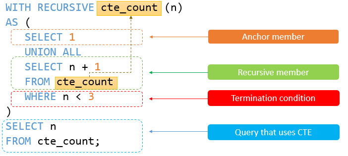

# Let's deep more into the My-SQL

## Procedure

[MySql Stored Procedure](https://www.mysqltutorial.org/mysql-stored-procedure/)
[Stored Procedures](https://www.mysqltutorial.org/mysql-stored-procedure/introduction-to-sql-stored-procedures/)

By definition, a stored procedure is a set of declarative SQL statements stored within the MySQL Server.

A sample of creaing a prcedure:

```sql
DELIMITER $$

CREATE PROCEDURE GetCustomers()
BEGIN
    SELECT 
        customerName, 
        city, 
        state, 
        postalCode, 
        country
    FROM
        customers
    ORDER BY customerName;    
END$$
DELIMITER ;
```

How to call it:

```sql
CALL GetCustomers();
```

Creating a Procedure with input output paramters:

```sql
DELIMITER //

create procedure GetOfficeByCountry(
    IN countryName varchar(255)
)
begin
    select *
    from offices
    where country = countryName;
end //

DELIMITER ;
```

How to call it :

```sql
call GetOrderCountByStatus('Shipped', @total);

select @total; 
```

Creating a procedure and using variable inside it:

```sql
DELIMITER //

create procedure GetTotalOrder()
begin
    declare totalOrder int default 0;
    
    select count(*)
    into totalOrder
    from orders;
 
    select totalOrder;
end //

DELIMITER ;
```

How to call:

```sql
call GetTotalOrder();
```

## Functions

[MySql Stored Function](https://www.mysqltutorial.org/mysql-stored-procedure/mysql-stored-function/)

Typically, you use the stored functions to encapsulate common formulas or business rules.

> Unlike the `stored procedure`, you can use a `stored function` in SQL statements wherever you use an expression.

Create a stored function :

```sql
-- Returns the customer level based on credit

DELIMITER //

create function CustomerLevel(
    credit decimal(10,2)
)
returns varchar(20)
deterministic
begin
    declare customerLevel varchar(20);
    
    if credit > 50000 then
        set customerLevel = 'PLATINUM';
    elseif (credit >= 50000 and credit <= 10000) then
        set customerLevel = 'GOLD';
    elseif credit < 10000 then
        set customerLevel = 'SILVER';
    end if;
    
    -- return the customer levle
    return(customerLevel);
end //

DELIMITER ;
```

How to call it:

```sql
-- show function status where db = 'classicmodels';

select
    customerName,
    CustomerLevel(creditLimit)
from
    customers
order by
    customerName;
```

Calling a stored function in a stored procedure

```sql
DELIMITER //

create procedure GetCustomerLevel(
    in customerNo int,
    out customerLevel varchar(20)
)
begin
    declare credit dec(10,2) default 0;
    
    -- get creadit limit of a customer
    select
        creditLimit
    into credit
    from customers
    where
        customerNumber = customerNo;
 
    -- call the function
    set customerLevel = CustomerLevel(credit);
end //

DELIMITER ;
```

How to use it :

```sql
call GetCustomerLevel(131,@customerLevel);
select @customerLevel;
```

## Cursor

A `cursor` is a database object used for iterating the result of a `SELECT statement`

Typically, you use cursors within stored procedures, triggers, and functions where you need **to process individual rows resturned by a query one at a time**

The following example illustrates how to use a cursor to iterate all rows in the employees table and concatenate the email into a string:

```sql
DELIMITER //

CREATE PROCEDURE CreateEmailList (
    INOUT email_list TEXT
)
BEGIN
    DECLARE done BOOL DEFAULT false;
    DECLARE email_address VARCHAR(100) DEFAULT "";
    
    -- declare cursor for employee email
    DECLARE cur CURSOR FOR SELECT email FROM employees;

    -- declare NOT FOUND handler
    DECLARE CONTINUE HANDLER 
        FOR NOT FOUND SET done = true;
 
    -- open the cursor
    OPEN cur;
 
    SET email_list = '';
 
    process_email: LOOP
  
        FETCH cur INTO email_address;
        
        IF done = true THEN 
            LEAVE process_email;
        END IF;
  
        -- concatenate the email into the emailList
        SET email_list = CONCAT(email_address,";",email_list);
    END LOOP;
    
    -- close the cursor
    CLOSE cur;

END //

DELIMITER ;
```

How to call it:

```sql
call CreateEmailList(@email_list);
select @email_list;
```

You can often achive the same thing useing `GROUP_CONCAT`, which is built for exactly this purpose.

For this case:

```sql
DELIMITER //

CREATE PROCEDURE CreateEmailList (
    OUT email_list TEXT
)
BEGIN
    SELECT GROUP_CONCAT(email SEPARATOR ';')
    INTO email_list
    FROM employees;
END //

DELIMITER ;
```

Call it:

```sql
CALL CreateEmailList(@email_list);
SELECT @email_list;
```

## Trigger

[MySql Triggers](https://www.mysqltutorial.org/mysql-triggers/)

The following table illustrates the availibity of the `OLD` and `NEW` modifiers:

| Trigger Event | OLD | NEW |
| ------------- | --- | --- |
| Insert        | No  | Yes |
| Update        | Yes | Yes |
| Delete        | Yes | No  |

Trigger update example:

```sql
-- Create a trigger in order to update item_changes table
DELIMITER //

create trigger UpdateItemsTrigger
after update
on items
for each row
begin
    insert into item_changes (item_id, change_type)
    values (NEW.id, 'UPDATE');
end //

DELIMITER ;
```

Before insert trigger example:

```sql
-- Drop the trigger
drop trigger if exists BeforeWorkCentersInsert;

-- Creating before insert trigger
DELIMITER //

create trigger BeforeWorkCentersInsert
before insert
on WorkCenters for each row
begin
    declare rowcount int;
    
    select count(*)
    into rowcount
    from WorkCenterStats;
    
    if rowcount > 0 then
        update WorkCenterStats
        set totalCapacity = totalCapacity + NEW.capacity;
    else
        insert into WorkCenterStats(totalCapacity)
        values(NEW.capacity);
    end if;
end //

DELIMITER ;
```

## CTE

[MySQL CTE](https://www.mysqltutorial.org/mysql-basics/mysql-cte/)

A recursive Common Table Expression (CTE) is a named temporary result set that references `itself` in the recursive member.



A good example :

```sql
with recursive EmployeeHierarchy as (
    -- Anchor
    select
    employee_id,
        employee_name,
        manager_id,
        0 as level
    from
        employees_2
    where
        manager_id is null -- Anchor member (root of the hierarchy)
        
    union all
    
    select
        e.employee_id,
        e.employee_name,
        e.manager_id,
        eh.level + 1
    from
        employees_2 e
    inner join
        EmployeeHierarchy eh on e.manager_id = eh.employee_id -- Recursive member
)
-- Final query to select from the CTE
select
    employee_id,
    employee_name,
    manager_id,
    level
from
    EmployeeHierarchy
order by
    level, employee_id;
```

Getting top sales using a CTE:

```sql
with TopSales2003CTE as (
    select
        salesRepEmployeeNumber employeeNumber,
        sum(quantityOrdered * priceEach) sales
    from
        orders
            inner join
        orderdetails using (orderNumber)
            inner join
        customers using (customerNumber)
    where
        year(shippedDate) = 2003 and status = 'Shipped'
    group by salesRepEmployeeNumber
    order by sales desc
    limit 5
)
select
    employeeNumber,
    firstName,
    lastName,
    sales
from
    employees
        join
    TopSales2003CTE using (employeeNumber);
```

Using multiple CTEs:

```sql
with SalesRep as (
    select
        employeeNumber,
        concat(firstName, ' ', lastName) as salesrepName
    from employees
    where jobTitle = 'Sales Rep'
),
CustomerSalesRep as (
    select
        customerName, salesrepName
    from
        customers
            inner join
        SalesRep on employeeNumber = salesrepEmployeeNumber
)
select *
from CustomerSalesRep
order by customerName;
```

## View

By definition, a `vaiw` is a named query stored in the databse catalog.

Let's create a simple customer view for their payments:

```sql
-- Define a view
create view CustomerPaymentsView
as
select
    customerName,
    checkNumber,
    paymentDate,
    amount
from
    customers
inner join
    payments using (customerNumber);
```

How to use it:

```sql
-- Call it
select * from CustomerPaymentsView;
```

## JSON Function

Creating a table with json column

If the output is difficult to read, you can use the `json_pretty()` to format it:

```sql
select
    name, json_pretty(properties)
    from products_2;
```

Getting the key of json document

```sql
select json_keys(properties)
from products_2;
```

Extracting data from a JSON document

```sql
select json_extract(properties, '$.sizes[2]')
from products_2;
```

Checking for Multiple Paths with ‘all’ Mode

```sql
SELECT 
    JSON_CONTAINS_PATH(
        '{"a": 1, "b": 2, "c": {"d": 4}}', 
        'all', '$.a', '$.e'
    ) result;
```

Output:

```txt
+--------+
| result |
+--------+
|      0 |
+--------+
```

Searching with the wildcard `%` in order to find out the `path`

```sql
select
    json_search(
        '{"name": "john", "age": 25, "username": "john@test.com"}',
        'all',
        'john%'
    ) path;
```

Output:

```txt
+-----------------------+
| path                  |
+-----------------------+
| ["$.name", "$.email"] |
+-----------------------+
```

## Cross Tab

## Pivot

## Execuation Plan
